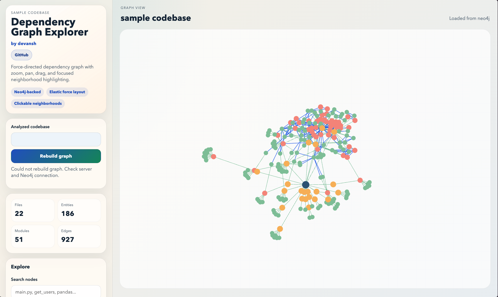

# Codebase Dependency Graph Prototype

This app scans a codebase, builds a dependency graph, stores it in Neo4j, and renders an interactive force-directed graph in the browser.

## What it models

- `Project` root node
- `File` nodes
- `Entity` nodes (functions, classes, basic methods)
- `Module` nodes (external imports)
- `CONTAINS`, `CALLS`, and `IMPORTS` relationships

## Local development

1. Install deps:

```bash
npm install
```

2. Set env:

```bash
cp .env.example .env
```

3. Start:

```bash
npm run dev
```

4. Open `http://localhost:3000` (or the fallback port printed in terminal).

## Environment variables

- `PORT`: server port
- `NODE_ENV`: `development` or `production`
- `TARGET_CODEBASE`: defaults to bundled `sample codebase`
- `NEO4J_URI`: `bolt://...` for local or `neo4j+s://...` for AuraDB
- `NEO4J_USERNAME`
- `NEO4J_PASSWORD`
- `NEO4J_DATABASE`

## Deploy (recommended): Render + Neo4j AuraDB

This repo now includes [render.yaml](/Users/devansh/Everything/Academics/DevDaddy/codeweb/render.yaml), so Render can auto-detect service settings.

### Notes

- `render.yaml` already sets `NODE_ENV=production`, start command, and health check path.
- If Neo4j is misconfigured, the app still runs in in-memory mode, but persistence is disabled.

## Alternate deployment (simple): Railway + AuraDB

You can also deploy this same Node app to Railway with start command `npm start` and the same Neo4j env vars. No extra code changes required.

## API endpoints

- `POST /api/analyze` with body `{ "rootPath": "/abs/path" }`
- `GET /api/graph`
- `GET /api/health`
- `GET /api/node-details?id=<nodeId>`

## !!!check it out in action!!!
- https://codeweb-8z86.onrender.com/

